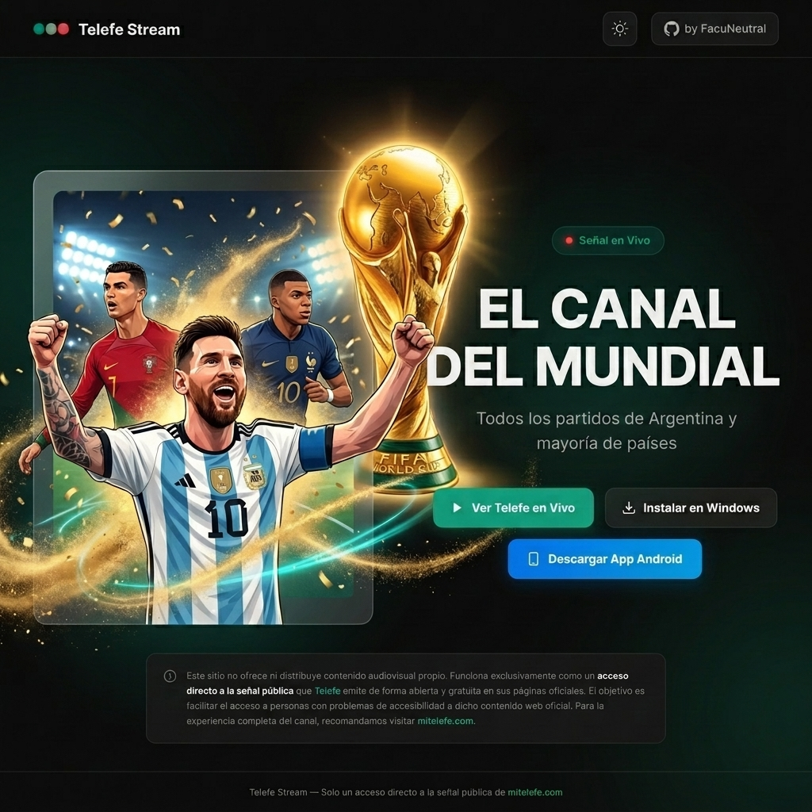
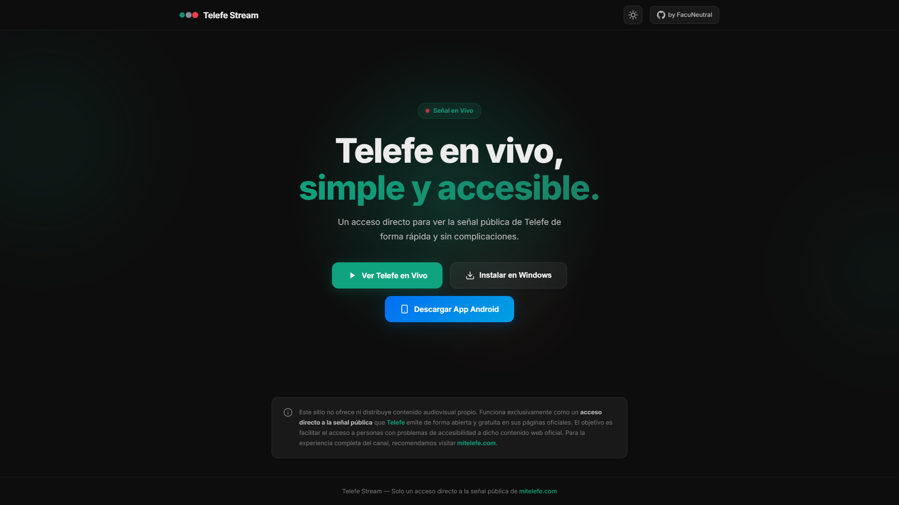

# 📺 Telefe Stream

<p align="center">
  
</p>

<p align="center">
  
  
</p>

---

## 🌟 Característica Principal

**Telefe Stream** es una aplicación diseñada para facilitar el acceso y la reproducción de la señal en vivo de **Telefe**. Su objetivo primordial es brindar un acceso directo, ágil y libre de interfaces pesadas o cargadas, permitiendo que la transmisión en vivo se inicie de forma casi instantánea tanto en navegadores web como en dispositivos móviles.

> [!IMPORTANT]
> **🏆 Novedad: El Canal del Mundial**  
> ¡Ahora con acceso al canal del Mundial! Disfruta de la transmisión de todos los partidos de Argentina y de la mayoría de los países participantes en vivo y en alta definición.

> [!NOTE]  
> **Simplificación de mitelefe.com**  
> Esta aplicación **no realiza retransmisiones independientes ni aloja contenido audiovisual**. Es una alternativa simplificada y optimizada del sitio oficial [mitelefe.com](https://mitelefe.com). Funciona consumiendo y tokenizando de manera dinámica el reproductor público oficial de Telefe a través de sus endpoints abiertos. Está pensada especialmente para mejorar la accesibilidad de usuarios que experimenten dificultades técnicas o lentitud al interactuar con el sitio web original.

---

## 🛠️ Tecnologías y Estructura del Proyecto

El repositorio está dividido en dos grandes componentes:

1. **`web-client`**: Cliente web desarrollado con **React**, **TypeScript**, **Vite** y configurado como una **PWA (Progressive Web App)**. Permite el streaming HLS directo en navegadores modernos mediante `hls.js`.
2. **`app`**: Aplicación móvil multiplataforma desarrollada en **React Native** con **Expo** y el módulo `expo-video` para una reproducción nativa, fluida y con soporte de aceleración por hardware.

---

## 🚀 Guía de Instalación y Ejecución Local

Sigue los pasos a continuación para configurar y ejecutar cualquiera de los dos entornos en tu máquina local.

### 📋 Requisitos Previos

- Tener instalado [Node.js](https://nodejs.org/) (versión 18 o superior recomendada).
- Para el desarrollo de la app móvil, se recomienda instalar la aplicación **Expo Go** en tu dispositivo físico (Android o iOS) desde su respectiva tienda de aplicaciones.

---

### 🌐 1. Configuración de la Web (`web-client`)

El cliente web utiliza un servidor de desarrollo con Vite configurado con un proxy inverso para redirigir las solicitudes a los endpoints de Telefe, evitando así los bloqueos de **CORS** en el navegador.

1. **Navega a la carpeta de la web:**
   ```bash
   cd web-client
   ```

2. **Instala las dependencias del proyecto:**
   ```bash
   npm install
   ```

3. **Inicia el servidor de desarrollo:**
   ```bash
   npm run dev
   ```

4. **Accede a la aplicación:**  
   Abre tu navegador e ingresa a la URL provista por la consola (generalmente `http://localhost:5173`).

5. **Construcción para producción (Opcional):**
   ```bash
   npm run build
   ```

---

### 📱 2. Configuración de la App Móvil (`app`)

La aplicación móvil utiliza Expo, lo que simplifica enormemente la ejecución de prueba sin necesidad de compilar proyectos de Android Studio o Xcode inicialmente.

1. **Navega a la carpeta de la aplicación:**
   ```bash
   cd app
   ```

2. **Instala las dependencias de React Native y Expo:**
   ```bash
   npm install
   ```

3. **Inicia el servidor de desarrollo de Expo:**
   ```bash
   npm run start
   ```

4. **Ejecución en dispositivos:**
   - **Dispositivo Físico:** Escanea el código QR que aparece en la terminal usando la cámara (iOS) o la app de **Expo Go** (Android).
   - **Emulador de Android:** Presiona `a` en la terminal (requiere Android Studio y un emulador configurado).
   - **Simulador de iOS:** Presiona `i` en la terminal (requiere macOS y Xcode instalado).
   - **Navegador Web:** Presiona `w` para ejecutar la versión web-native (`expo start --web`).

---

## ⚠️ Descargo de Responsabilidad (Disclaimer)

Todos los derechos intelectuales, logotipos, marcas comerciales y la señal de transmisión de video pertenecen única y exclusivamente a **Telefe / Paramount Global**. Esta aplicación tiene un propósito puramente de desarrollo, aprendizaje personal y mejora de la accesibilidad para uso privado. No se comercializa ni se utiliza para fines de lucro de ningún tipo.
